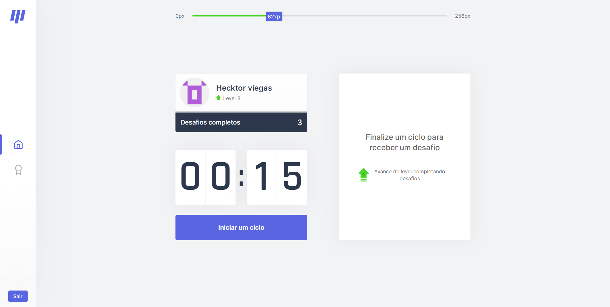
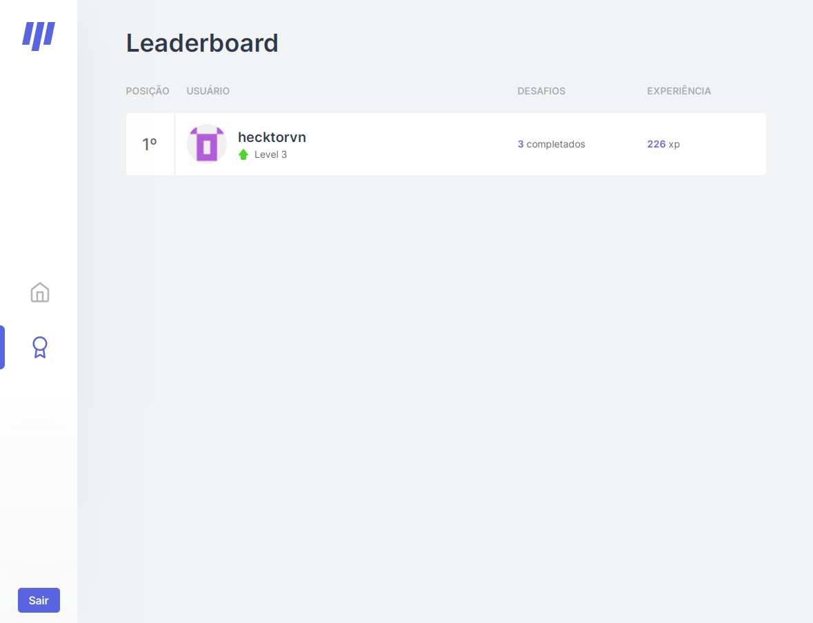

--- 

<p>
  <a href="https://www.linkedin.com/in/hecktorvn/">
      
  </a>
  
  
  
  
  
  
</p>

<div align="center">
  <sub>O <strong>MoveIt</strong> foi desenvolvido com ❤︎ pelo
    <a href="https://github.com/hecktorvn">Hecktor Viegas</a>
  </sub>
</div>

# :pushpin: Tópicos 

[Demo](#eyes-demo)

[Sobre o Move.it](#page_with_curl-sobre-o-moveit)

[Tecnologias](#computer-tecnologias)

[Instalação e uso](#construction_worker-instalação-e-uso)

[Licença](#closed_book-licença)

<br>

# :eyes: Demo

Demo: <http://moveit-hecktorvn.vercel.app/>

<br>

## :page_with_curl: Sobre o Move.it

O Move.it é um App que utiliza a técnica de [pomodoro](https://pt.wikipedia.org/wiki/T%C3%A9cnica_pomodoro), com o objetivo de melhorar sua produtividade e foco, e junto com isso nos intervalos nos exercitamos.
O projeto foi desenvolvido durante a Next Level Week #4 da [Rocketseat](https://rocketseat.com.br/).

<br>

<p align="center">
  
  
  
</p>

# :computer: Tecnologias

Tecnologias e ferramentas utilizadas no desenvolvimento do projeto:

- [React](https://reactjs.org/)
- [Next.js](https://nextjs.org/)
- [TypeScript](https://www.typescriptlang.org/)
- [Styled Components](https://styled-components.com/)
- [VS Code](https://code.visualstudio.com/) com [ESLint](https://eslint.org/), [Prettier](https://prettier.io/) e [EditorConfig](https://editorconfig.org/)

<br>

# :construction_worker: Instalação e uso

```bash
# Abra um terminal e copie este repositório com o comando
git clone https://github.com/hecktorvn/moveit.git
# ou use a opção de download.

# Entre na pasta web com 
cd moveit

# Instale as dependências
yarn install
ou
npm install

# Rode o aplicação
yarn dev
ou
npm run dev

# Acesse http://localhost:3000 no seu navagador.
```

<br>

# :closed_book: Licença
Esse projeto está sob a licença MIT. Veja o arquivo [LICENSE](/LICENSE) para mais detalhes.

---

<div align="center">
  Feito com :purple_heart: by [Hecktor Viegas](https://github.com/hecktorvn) 
</div>